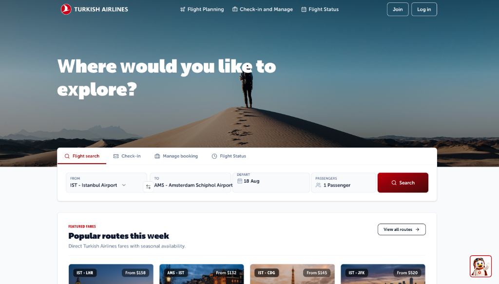
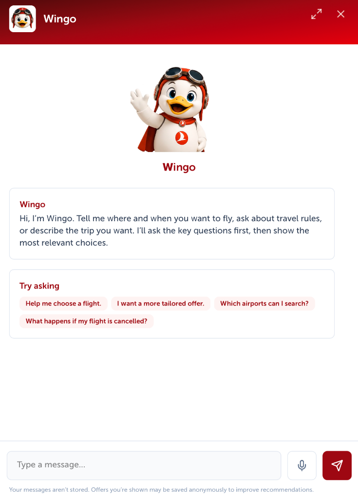

# ✈️ Turkish Airlines Dynamic Pricing & Wingo AI Flight Assistant

A dynamic airline revenue management and AI-powered flight booking assistant (**Wingo**) built for Turkish Airlines. The project seamlessly unifies a rule-based dynamic pricing engine, an official-regulation RAG (Retrieval-Augmented Generation) knowledge base, and a live Turkish Airlines MCP (Model Context Protocol) integration within a modern web application.

---

## 📸 Application Showcase

### 🌐 Flight Search & Booking Portal
<p align="center">
  
</p>

### 🤖 Wingo AI Travel Assistant Modal
<p align="center">
  
</p>

---

## 🌟 Core Highlights & Architecture

### 1. 🧮 Dynamic Pricing Engine (`app/pricer`)
- **Demand & Time Multipliers:** Real-time pricing calculations adjusted by departure proximity and seat inventory load.
- **Passenger Classification Rules:**
  - **Adult:** 100% base fare + $240 fixed airport/security tax.
  - **Child (2–12 yrs):** 75% base fare + $240 tax (allocated seat).
  - **Infant (0–2 yrs):** 10% base fare, **tax-exempt** (travels on lap, no seat occupied).
- **Round-Trip Discount:** Automatic 12% discount (0.88x multiplier) on round-trip itineraries.
- **Branded Fare Families:** EcoFly, ExtraFly, PrimeFly, BusinessFly, and BusinessPrime fare structures.
- **Personalized Dynamic Bundles:** Instantly combines flight, fare class, and ancillary options into three tailored packages (*Economy*, *Recommended*, *Comfort*) based on user travel purpose.
- **Two-Phase Transaction Guardrail:** Price quotes (`quote_purchase`) are separated from ticketing; purchases (`commit_purchase`) are never committed without explicit user confirmation.

---

### 2. 🤖 Wingo AI Agent & Safety Guardrails (`app/agent`)
- **Strict Data Grounding:**
  - 🟢 **Live/Transactional Data (Fares, Seats, Bookings):** The LLM never hallucinates numbers; all live data originates exclusively from deterministic tool executions (`search_flights`, `search_thy_live`).
  - 🔵 **Rules, Policies & Passenger Rights:** Served via semantic search over ChromaDB RAG, returning verified citations (document name + page number).
- **Tool Calling & Session State:** Multi-turn conversation management via Azure OpenAI (`gpt-5.4-mini` / `gpt-4o`) with pending purchase intent tracking.
- **Domain Guardrails:** Off-topic queries (recipes, coding, generic advice) are politely declined in a single concise sentence to keep conversations focused on travel.

---

### 3. 📚 Verifiable RAG Knowledge Base (`data/` & `app/agent/rag.py`)
- **Zero Hallucination Guarantee:** Built exclusively from official, verifiable PDF documents extracted via `pypdf` (`data/SOURCES.md`):
  1. **THY Branded Fares Official Announcement (2022):** EcoFly / ExtraFly / PrimeFly / Business package entitlements, baggage allowances, seat selection, reissue and refund conditions.
  2. **DGCA SHY-YOLCU Passenger Rights Regulation:** Cancellation, delay, denied boarding (overbooking), compensation rights, catering, and accommodation mandates.
- **ChromaDB Vector Store:** Local persistent cosine-similarity embeddings without external API costs or latency.

---

### 4. 🌐 Live THY MCP (Model Context Protocol) & OAuth 2.0 (`app/agent/thy_mcp.py`)
- Real-time connection to the Turkish Airlines live MCP endpoint:
  - Live flight search and fare comparison (`search_thy_live`).
  - PNR & Surname booking lookup and baggage allowance inquiry (`booking_details`, `booking_baggage`).
- **OAuth 2.0 PKCE Flow:** Miles&Smiles one-click sign-in with automatic token persistence and refresh (`data/thy_tokens.json`).

---

### 5. 💻 Modern Web Application (`app/web`)
- **FastAPI + Jinja2 + Vanilla CSS** responsive frontend.
- Interactive flight search with dynamic pricing breakdowns, seat counters, and route suggestions.
- Embedded Wingo chat panel featuring live tool execution traces, voice input (Speech-to-Text), and data source toggles (*Our System*, *THY Live*, *Both*).

---

## 📂 Project Directory Structure

```text
Pricing_chatbot/
├── app/
│   ├── agent/                 # Wingo AI Agent & Integrations
│   │   ├── core.py            # Agent loop, system prompt, guardrails
│   │   ├── tools.py           # Function-calling schema & tool dispatcher
│   │   ├── rag.py             # ChromaDB RAG & semantic search service
│   │   ├── thy_mcp.py         # Live Turkish Airlines MCP client
│   │   └── thy_auth.py        # OAuth 2.0 PKCE authentication flow
│   ├── pricer/                # Pricing Engine & Database
│   │   ├── domain.py          # SQLite schema, airport inventory, pricing rules
│   │   └── service.py         # Flight search, quote generator, dynamic bundles
│   └── web/                   # Web Application (FastAPI)
│       ├── server.py          # FastAPI routes, endpoints, session handling
│       ├── templates/         # Jinja2 HTML templates (index.html)
│       └── static/            # CSS, JS, branding assets & destination media
├── assets/                    # Project screenshots & documentation images
├── data/
│   ├── sources/               # Official source PDFs (Branded Fares, SHY-YOLCU)
│   ├── thy_knowledge_base.json# Extracted knowledge chunks with page provenance
│   ├── chroma/                # Persistent ChromaDB vector index
│   ├── pricer.sqlite3         # Flight inventory & booking SQLite database
│   └── SOURCES.md             # RAG provenance & citation reference
├── pyproject.toml / uv.lock   # Project dependencies & package lockfiles
├── requirements.txt           # Standard Python requirements
└── .env.example               # Environment variables template
```

---

## 🚀 Getting Started

### 1. Environment Setup & Dependencies

You can run the project using either `uv` (recommended) or standard Python virtual environment:

#### Option A: Using `uv` (Recommended)
```bash
uv sync
```

#### Option B: Using standard Python `venv`
```bash
python3 -m venv .venv
source .venv/bin/activate
pip install -r requirements.txt
```

---

### 2. Configure Environment Variables (`.env`)

Copy `.env.example` to `.env` and fill in your API configuration:

```bash
cp .env.example .env
```

Edit your `.env` file:
```ini
# Azure OpenAI (Required for the AI Agent)
AZURE_OPENAI_API_KEY=your-azure-api-key
AZURE_OPENAI_BASE_URL=https://<your-resource>.openai.azure.com/openai/v1/
AGENT_MODEL=gpt-5.4-mini

# Live Turkish Airlines MCP URL (Optional for live MCP comparisons)
THY_MCP_URL=https://mcp.turkishtechlab.com/mcp
```

---

### 3. (Optional) Turkish Airlines MCP OAuth Login

To enable live THY flight comparisons and PNR lookup via MCP, perform the one-time OAuth authorization:

```bash
python -m app.agent.thy_auth
```
*This opens a browser window for Miles&Smiles login and automatically stores refreshable tokens in `data/thy_tokens.json`.*

---

### 4. Start the Web Server

Launch the FastAPI application with Uvicorn:

```bash
uvicorn app.web.server:app --reload --port 8000
```

Open your browser and navigate to:
👉 **[http://localhost:8000](http://localhost:8000)**

---

## 📡 Key API Endpoints

| Method | Endpoint | Description |
|---|---|---|
| `GET` | `/` | Main flight search portal & Wingo assistant UI |
| `POST` | `/search` | Form-based flight search (server-side rendered results) |
| `POST` | `/chat` | Wingo AI agent conversation endpoint (`message`, `source`, `lang`) |
| `GET` | `/mcp/auth/status` | Check live THY MCP OAuth session status |
| `POST` | `/mcp/booking` | Live THY PNR details and baggage allowance lookup |

---

## 🛡️ Security & Business Rules (Quick Reference)

1. **Zero Hallucination Policy:** Flight fares, seat counts, and PNR details are strictly retrieved via tool calls; the LLM is prohibited from guessing or fabricating prices.
2. **Official Citations:** When answering passenger rights or fare class questions, Wingo cites the official document and page number (e.g., *(Source: SHY-YOLCU Regulation, Art. 6)*).
3. **Two-Phase Booking Safety:** Wingo creates a transparent price quote breakdown (`quote_purchase`) first, requiring explicit passenger confirmation before executing a write operation (`commit_purchase`).
